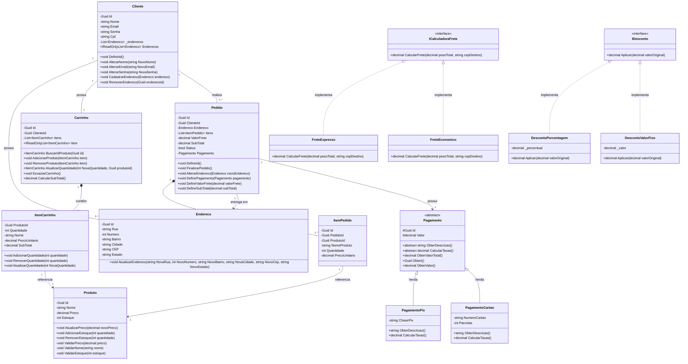

# Sistema E-commerce

API REST desenvolvida em C# .NET 9.0 para gerenciamento de e-commerce com implementação de padrões de projeto e princípios de orientação a objetos.

**Disciplina**: Programação Orientada a Objetos  
**Avaliação**: AV2
**Integrantes da Equipe**:
- Arthur Rezende de Oliveira - 06010228
- Eduardo Leal Ferreira Silva - 06013706
- Luna Ferreira de Mattos - 06009983
- Pedro Freitas da Costa Santos - 06009656
- Pedro Henrique Alves da Silva - 06003335
- Yuri Domingues Santos - 06010142

## Funcionalidades

O sistema permite:
- Gestão de clientes (cadastro, atualização, remoção)
- Gerenciamento de produtos e estoque
- Operações de carrinho de compras
- Criação e finalização de pedidos
- Múltiplos métodos de pagamento (PIX, Cartão)
- Cálculo automático de frete

## Critérios de Avaliação Implementados

### 1. Modelagem de Classes Coerente (1,0 ponto)

Classes principais: Produto, ItemCarrinho, Carrinho, Pedido, Cliente, Endereco.

Localização: `/E-commerce/Domain/Entities/`

### 2. Diagrama UML com Multiplicidades (1,0 ponto)

Diagrama completo implementado em Mermaid incluindo:
- Multiplicidades (1, 0..1, 0..*, 1..*)
- Herança (Pagamento → PagamentoPix, PagamentoCartao)
- Interfaces (ICalculadoraFrete, IDesconto)
- Composições (Carrinho *-- ItemCarrinho)

Ver seção: Diagrama de Classes UML

### 4. Herança e Polimorfismo (1,0 ponto)

Hierarquia polimórfica implementada:

```csharp
public abstract class Pagamento
{
    protected Guid Id { get; private set; }
    protected decimal Valor { get; private set; }
    
    public abstract decimal CalcularTaxas(); // Implementação polimórfica
    
    public decimal ObterValorTotal()
    {
        return Valor + CalcularTaxas();
    }
}

public class PagamentoPix : Pagamento
{
    public override decimal CalcularTaxas() => 0m;
}

public class PagamentoCartao : Pagamento
{
    public override decimal CalcularTaxas() => ObterValor() * 0.03m;
}
```

Elimina condicionais. O comportamento é determinado pela classe concreta em runtime.

### 5. Encapsulamento e Coesão (1,0 ponto)

Propriedades com setter privado e métodos públicos validados:

```csharp
public decimal ValorFrete { get; private set; }

public void DefinirValorFrete(decimal valorFrete)
{
    if (valorFrete < 0)
        throw new ArgumentException("O valor do frete não pode ser negativo.");
    ValorFrete = valorFrete;
}
```

### 6. Tratamento de Exceções (1,0 ponto)

Validações em construtores, métodos de negócio e controllers:

```csharp
public void FinalizarPedido()
{
    if (Itens == null || Itens.Count <= 0)
        throw new InvalidOperationException("Não é possível finalizar um pedido sem itens.");
    
    if (Pagamento == null)
        throw new InvalidOperationException("Não é possível finalizar um pedido sem forma de pagamento.");
    
    Status = true;
}
```

### 7. Baixo Acoplamento e Alta Coesão (1,0 ponto)

Arquitetura em camadas com Dependency Injection:

```
Domain/         → Entidades e regras de negócio
Application/    → Lógica de aplicação e DTOs
Infrastructure/ → Repositórios e acesso a dados
E-commerce/     → Controllers (API)
```

Exemplo de DI:

```csharp
public class PedidoService
{
    private readonly ICalculadoraFrete calculadoraFrete;
    
    public PedidoService(..., ICalculadoraFrete calculadoraFrete)
    {
        this.calculadoraFrete = calculadoraFrete;
    }
    
    public void CriarPedido(Guid clienteId, EnderecoDTO enderecoDTO)
    {
        decimal valorFrete = calculadoraFrete.CalcularFrete(pesoTotal, enderecoDTO.CEP ?? "");
    }
}
```

### 8. Padrões DTO e Service (1,0 ponto)

DTOs: CadastroClienteDto, AdicionarProdutoCarrinhoDTO, PedidoDTO, EnderecoDTO, etc.  
Services: ClienteService, CarrinhoService, PedidoService, ProdutoService

Localização:
- DTOs: `/E-commerce/Application/DTOs/`
- Services: `/E-commerce/Application/Services/`

### 9. Regras Extensíveis (Strategy Pattern) (1,0 ponto)

Interfaces que permitem adicionar novos comportamentos sem modificar código existente:

```csharp
public interface ICalculadoraFrete
{
    decimal CalcularFrete(decimal pesoTotal, string cepDestino);
}

public class FreteExpresso : ICalculadoraFrete
{
    private const decimal TaxaPorKg = 15.0m;
    public decimal CalcularFrete(decimal pesoTotal, string cepDestino)
    {
        return pesoTotal * TaxaPorKg;
    }
}
```

Para adicionar "FreteInternacional", basta criar nova classe implementando ICalculadoraFrete.

### 10. Visibilidade no UML e Código (1,0 ponto)

Notação UML: `+` (public), `-` (private), `#` (protected)

Correspondência no código:

```csharp
public abstract class Pagamento
{
    protected Guid Id { get; private set; }      // # no UML
    protected decimal Valor { get; private set; } // # no UML
    
    public abstract string ObterDescricao();     // + no UML
}

public class Produto
{
    public Guid Id { get; private set; }         // - no UML (setter privado)
    
    public void AtualizarPreco(decimal novoPreco) // + no UML
    {
        ValidarPreco(novoPreco);
        Preco = novoPreco;
    }
    
    private void ValidarPreco(decimal preco)      // - no UML
    {
        if (preco <= 0)
            throw new ArgumentException("O preço deve ser maior que zero.");
    }
}
```

## Como Executar

Requisitos:
- .NET SDK 9.0 ou superior

Passos:

```bash
cd E-commerce
dotnet build
cd E-commerce
dotnet run --project E-commerce.csproj
```

Aplicação rodará em `http://localhost:5090`

## Testando via Postman

Collection completa disponível em: `/E-commerce-API.postman_collection.json`

A collection inclui 23 requests com exemplos de:
- Cadastro de clientes e produtos
- Operações de carrinho
- Criação de pedidos
- Definição de pagamento (PIX/Cartão)
- Finalização de pedidos

## Diagrama de Classes UML



Legenda:
- Multiplicidades: `1` (um), `0..1` (opcional), `0..*` (zero ou mais), `1..*` (um ou mais)
- Visibilidade: `+` (public), `-` (private), `#` (protected)
- Relacionamentos: `--` (associação), `*--` (composição), `-->` (dependência), `<|--` (herança), `<|..` (implementação)

## Estrutura do Projeto

```
E-commerce/
├── Domain/
│   ├── Entities/              # Cliente, Produto, Carrinho, Pedido, Pagamento
│   ├── Interfaces/            # ICalculadoraFrete, IDesconto
│   └── Services/              # FreteExpresso, DescontoPorcentagem
├── Application/
│   ├── Services/              # ClienteService, ProdutoService, CarrinhoService, PedidoService
│   ├── DTOs/                  # Data Transfer Objects
│   └── Interfaces/            # Contratos de serviços
├── Infrastructure/
│   ├── Repositories/          # Implementação de acesso a dados
│   └── Database/              # Armazenamento em memória
└── E-commerce/
    ├── Controllers/           # ClienteController, ProdutoController, CarrinhoController, PedidoController
    └── Program.cs             # Configuração da aplicação e DI
```

## Tecnologias

- C# .NET 9.0
- ASP.NET Core
- AutoMapper
- Dependency Injection

## Decisões de Design

**Strategy Pattern para Frete**: Permite adicionar novas estratégias sem modificar código existente (Open/Closed Principle).

**Herança para Pagamento**: Cada tipo de pagamento conhece suas regras de taxa, eliminando condicionais.

**Encapsulamento com private set**: Garante que mudanças de estado passem por validações obrigatórias.
